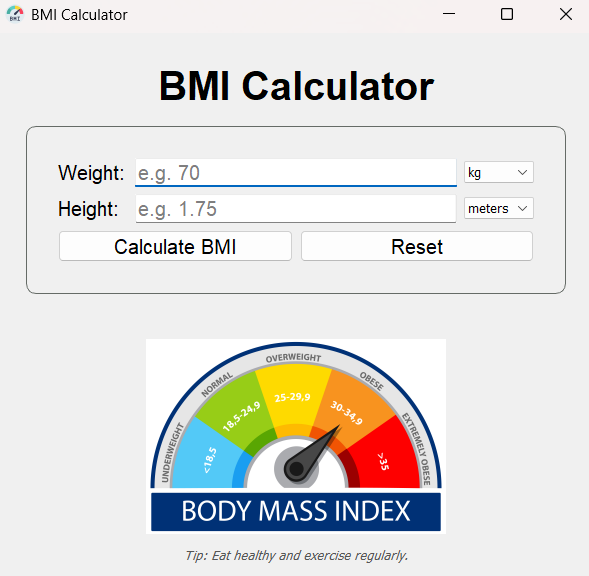

# BMI Calculator (PyQt5)

A modern, responsive Body Mass Index (BMI) Calculator built with **Python** and **PyQt5**.  
It allows users to input their height and weight in multiple units (kg/lbs and meters/inches) and instantly calculates their BMI, displays a result with color-coded health categories, and shows a BMI classification chart.

---

## 🚀 Features

- 🧮 Real-time BMI Calculation
- 📏 Supports multiple units: `kg/lbs` and `meters/inches`
- 🎨 Color-coded result: Underweight, Normal, Overweight, Obese
- 🖼️ Responsive BMI Chart that resizes with the window
- 🧼 Reset button to clear all fields
- 📐 Clean, grouped layout using `QGroupBox`

---

## 📸 Screenshot

  

---

## 🛠️ Requirements

- Python 3.x
- PyQt5

Install dependencies using:

```bash
pip install PyQt5
