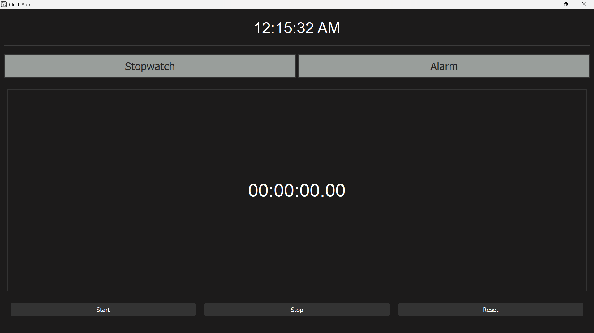
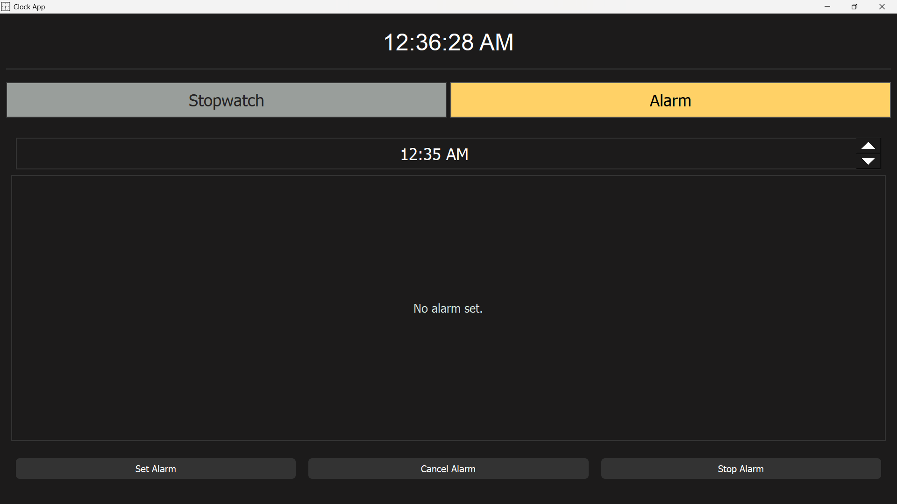

# ⏰Clock App

A modern desktop **Clock App** built using **Python** and **PyQt5**. This app features a real-time clock, a fully functional **stopwatch**, and an **alarm** system with sound alerts and auto-stop functionality.

---

## 🚀 Features

- 🕒 **Live Clock** (with AM/PM format)
- ⏱️ **Stopwatch** with Start, Stop, Reset
- ⏰ **Alarm** with:
  - Time picker
  - Alarm status display
  - Built-in sound (auto-stops after 1 minute)
- 🎵 **Sound Notifications** using `QSoundEffect`
- 💅 **Dark-themed UI** with custom styling
- 🧩 Clean layout using stacked widgets for tabs

---

## 📸 Screenshots

### 🕒 Stopwatch


### ⏱️ Alarm


---
## 📦 Requirements

- Python 3.6 or later
- PyQt5

### Install dependencies:

```bash
pip install PyQt5
