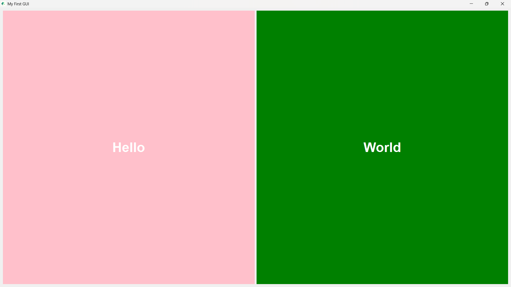

# 👋 Hello World GUI (PyQt5)

This is a simple GUI application built using **PyQt5** that displays the message "Hello, World!" in a window.

---

## 🛠️ Technologies Used

- **Python 3**
- **PyQt5** – A powerful GUI framework for Python

---

## 📸 Screenshot

 

---

## 🚀 How to Run

1. Install the required package:
   ```bash
   pip install pyqt5
